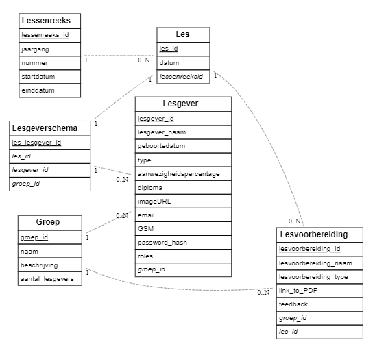
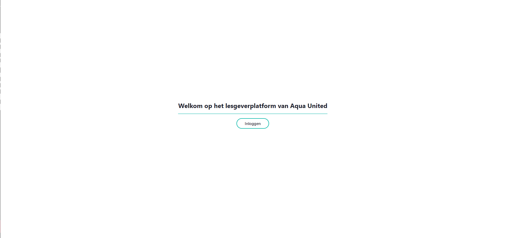
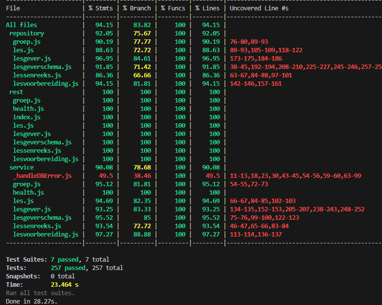

# Lander Dhaen (202293982)

- [x] Front-end Web Development
  - <https://github.com/Web-IV/2324-frontendweb-LanderDhaen>
  - <https://web-iv-2324-frontendweb-landerdhaen.onrender.com>
- [x] Web Services: GITHUB URL
  - <https://github.com/Web-IV/2324-webservices-LanderDhaen>
  - <https://two324-webservices-landerdhaen.onrender.com>

**Logingegevens**

Admin

- Gebruikersnaam/e-mailadres: lander.dhaen@gmail.com
- Wachtwoord: 12345678

User

- Gebruikersnaam/e-mailadres: evert.walravens@move-united.be
- Wachtwoord: 12345678

## Projectbeschrijving

Ik heb een platform ontwikkelt voor Aqua United, een zwemschool binnen Aalst. Op dit platform kunnen leden van het bestuur lesgevers aanmaken, aanpassen en verwijderen. Gegevens van lesgevers, groepen, lesvoorbereidingen en schemas kunnen ze ook raadplegen op verschillende manieren. Het aanmaken en aanpassen van lesgeverschema's kan ook via het platform.

Gewone lesgevers kunnen hun eigen gegevens en de lesvoorbereidingen raadplegen. Daarnaast hebben ze een persoonlijk account waarop hun aanwezigheden per lessenreeks kunnen zien (gebaseerd op de schema's). Ze hebben ook toegang tot een agenda waarop lesdagen ingepland staan.

## Screenshots

Landingspagina

Lesgevertabel met sorteeropties

Lesgevers opzoeken

Schema aanmaken

Schema aanpassen

Namen invullen/aanpassen

## API calls

Niet elke API call werd gebruikt in de front-end

### Lesgevers

- `GET /api/lesgevers`: alle lesgevers ophalen
- `GET /api/lesgevers/:id`: lesgever met een bepaald id ophalen
- `GET /api/lesgevers/:id/lesgeverschemas`: aanwezigheden ophalen van lesgever met bepaald id
- `POST /api/lesgevers`: aanmaken van lesgever
- `POST /api/lesgevers`: inloggen van lesgever
- `PUT /api/lesgevers/:id`: lesgever met bepaald id aanpassen
- `DELETE /api/lesgevers/:id`: lesgever met bepaald id verwijderen

### Groepen

- `GET /api/groepen`: alle groepen ophalen
- `GET /api/groepen/:id`: groep met een bepaald id ophalen
- `GET /api/groepen/:id/lesgevers`: lesgevers ophalen van groep met een bepaald id
- `GET /api/groepen/:id/lesvoorbereidingen`: lesvoorbereidingen ophalen van groep met een bepaald id
- `POST /api/groepen`: aanmaken van groep
- `PUT /api/groepen/:id`: groep met bepaald id aanpassen
- `DELETE /api/groepen/:id`: groep met bepaald id verwijderen

### Lessen

- `GET /api/lessen`: alle lessen ophalen
- `GET /api/lessen/:id`: les met een bepaald id ophalen
- `GET /api/lessen/:id/lesgeverschemas`: schemas ophalen van les met een bepaald id
- `POST /api/lessen`: aanmaken van les
- `PUT /api/lessen/:id`: les met bepaald id aanpassen
- `DELETE /api/lessen/:id`: les met bepaald id verwijderen

### Lesgeverschemas

- `GET /api/lesgeverschemas`: alle lesgeverschemas ophalen
- `POST /api/lesgeverschemas`: aanmaken van lesgeverschema
- `PUT /api/lesgeverschemas/:id`: lesgeverschema met bepaald id aanpassen
- `DELETE /api/lesgeverschemas/:id`: lesgeverschema met bepaald id verwijderen

### Lessenreeksen

- `GET /api/lessenreeksen`: alle lessenreeksen ophalen
- `GET /api/lessenreeksen/:id`: lessenreeks met een bepaald id ophalen
- `GET /api/lessenreeksen/:id/lessen`: lessen ophalen van lessenreeks met een bepaald id
- `POST /api/lessenreeksen`: aanmaken van lessenreeks
- `PUT /api/lessenreeksen/:id`: lessenreeks met bepaald id aanpassen
- `DELETE /api/lessenreeksen/:id`: lessenreeks met bepaald id verwijderen

### Lesvoorbereidingen

- `GET /api/lesvoorbereidingen`: alle lesvoorbereidingen ophalen
- `GET /api/lesvoorbereidingen/:id`: lesvoorbereiding met een bepaald id ophalen
- `POST /api/lesvoorbereidingen`: aanmaken van lesvoorbereiding
- `PUT /api/lesvoorbereidingen/:id`: lesvoorbereiding met bepaald id aanpassen
- `DELETE /api/lesvoorbereidingen/:id`: lesvoorbereiding met bepaald id verwijderen

## Behaalde minimumvereisten

### Front-end Web Development

- **componenten**

  - [x] heeft meerdere componenten - dom & slim (naast login/register)
  - [x] applicatie is voldoende complex
  - [x] definieert constanten (variabelen, functies en componenten) buiten de component
  - [x] minstens één form met meerdere velden met validatie (naast login/register)
  - [x] login systeem
         

- **routing**

  - [x] heeft minstens 2 pagina's (naast login/register)
  - [x] routes worden afgeschermd met authenticatie en autorisatie
         

- **state-management**

  - [x] meerdere API calls (naast login/register)
  - [x] degelijke foutmeldingen indien API-call faalt
  - [x] gebruikt useState enkel voor lokale state
  - [x] gebruikt gepast state management voor globale state - indien van toepassing
         

- **hooks**

  - [x] gebruikt de hooks op de juiste manier
         

- **varia**

  - [x] een aantal niet-triviale e2e testen
  - [x] minstens één extra technologie
  - [x] maakt gebruik van de laatste ES-features (async/await, object destructuring, spread operator...)
  - [x] duidelijke en volledige README.md
  - [x] volledig en tijdig ingediend dossier en voldoende commits

### Web Services

- **datalaag**

  - [x] voldoende complex (meer dan één tabel, 2 een-op-veel of veel-op-veel relaties)
  - [x] één module beheert de connectie + connectie wordt gesloten bij sluiten server
  - [x] heeft migraties - indien van toepassing
  - [x] heeft seeds
         

- **repositorylaag**

  - [x] definieert één repository per entiteit (niet voor tussentabellen) - indien van toepassing
  - [x] mapt OO-rijke data naar relationele tabellen en vice versa - indien van toepassing
         

- **servicelaag met een zekere complexiteit**

  - [x] bevat alle domeinlogica
  - [x] bevat geen SQL-queries of databank-gerelateerde code
         

- **REST-laag**

  - [x] meerdere routes met invoervalidatie
  - [x] degelijke foutboodschappen
  - [x] volgt de conventies van een RESTful API
  - [x] bevat geen domeinlogica
  - [x] geen API calls voor entiteiten die geen zin hebben zonder hun ouder (bvb tussentabellen)
  - [x] degelijke authorisatie/authenticatie op alle routes
         

- **algemeen**

  - [x] er is een minimum aan logging voorzien
  - [x] een aantal niet-triviale integratietesten (min. 1 controller >=80% coverage)
  - [x] minstens één extra technologie
  - [x] maakt gebruik van de laatste ES-features (async/await, object destructuring, spread operator...)
  - [x] duidelijke en volledige README.md
  - [x] volledig en tijdig ingediend dossier en voldoende commits

## Projectstructuur

### Front-end Web Development

Ik heb mijn src onderverdeeld in mappen voor api, assest, componenten, contexts en pages.

Componenten zijn dom, de pages zijn slim. Alles is onderverdeeld per entiteit om het overzicht te bewaren. Zo is alles omtrent groepen in een submap groepen verdeeld. Enkel de componenten die over meerdere entiteiten gebruikt worden zoals de header staan in de shared submap.

Daarnaast staat de code rond testen in de cypress map.

### Web Services

Ik heb mijn project onderverdeeld in mappen voor testing, configuratie en src. In de src map is de onderverdeling gebaseerd op de verschillende lagen. Zo bevat de data submap alles omtrent de data (migrations, seeds, mock-data). De repository submap bevat alles over het uitvoeren van queries op de database. De service submap behandelt het doorgeven van de calls uit de rest laag naar de repository laag. Hier worden ook bepaalde errors opgevangen indien de queries onverwachte data teruggeven. De rest submap beheert alles omtrent het ontvangen, valideren en authoriseren van API calls, om deze dan door te geven naar de service laag.

Elke laag is onderverdeeld in submappen per entiteit om het overzicht te bewaren.

## Extra technologie

### Front-end Web Development

Ik heb gebruik gemaakt van Chakra UI en Formik als extra functionaliteiten.

ChakraUI: <https://chakra-ui.com/>

Componenten library voor React applicaties. Je importeert reeds gemaakte componenten om snel applicaties te bouwen.

Formik: <https://formik.org/>

Open source form libary die declaratief en intuitief formulieren helpt maken.

### Web Services

ObjectMapper: <https://www.npmjs.com/package/object-mapper>

Library die a.d.h.v van een opgestelde map een object omvormt naar een ander object.

## Testresultaten

### Front-end Web Development

it("should show the lesgevers")

it("should add a new lesgever and return to the table")
it("should show the lesgever in the table")
it("should remove the lesgever")

Ik heb een test geschreven die alle lesgevers ophaalt na het inloggen en controleert of deze gegevens wel juist zijn. Daarnaast heb ik een test geschreven die een lesgever aanmaakt, controleert of hij rerout naar de tabel. Nadien controleert hij of de lesgever weldegelijk in de tabel toegevoegd is om hem uiteindelijk weer te verwijderen

### Web Services

Ik heb voor elke entiteit elke API call getest, zowel het normale verloop als bijna alle edge-cases (controleren of de juiste foutmelding wordt gegooid). Er wordt ook gecontroleerd of de ingelogde lesgever deze API calls mag uitvoeren.

Het is voor elke entiteit gelijkaardig, dus bij deze een oplijsting van lesgever:

GET /api/lesgevers

- test("should 200 and return all lesgevers")
- test("should 400 when given an argument")
- test("should 403 when not admin")

GET /api/lesgevers/:id

- test("should 200 and return the correct lesgever")
- test("should 404 when requesting not existing lesgever")
- test("should 400 with invalid lesgever_id")
- test("should 403 when not admin and requesting different user")

GET /api/lesgevers/:id/lesgeverschemas

- test("should 200 and return the correct schemas for the requested lesgever")
- test("should 404 when requesting not existing lesgever")
- test("should 400 with invalid lesgever_id")
- test("should 403 when not admin and requesting different user")

PUT /api/lesgevers/:id

- test("should 200 and return the updated lesgever")
- test("should 404 with not existing lesgever")
- test("should 400 with invalid lesgever_id")
- test("should 404 when groep does not exist")
- test("should 400 when missing (voor elke paramater een test))
- test("should 403 when not admin")

POST /api/lesgevers

- test("should be 201 and return the created lesgever")
- test("should 400 when groep does not exist")
- test("should 400 when duplicate email")
- test("should 400 when duplicate gsm")
- test("should 400 when missing (voor elke paramater een test))
- test("should 403 when not admin")

DELETE /api/lesgevers/:id

- test("should be 204 and return nothing")
- test("should 400 with invalid lesgever_id")
- test("should 404 with not existing lesgever")
- test("should 403 when not admin")

De AuthHeader werd ook op elke route getest.

Coverage:

## Gekende bugs

### Front-end Web Development

Het ophalen van de lesgever na inloggen duurt lang omdat de eerste call altijd faalt.

### Web Services

/
